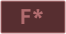
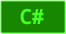

<h1 align="center">

GitHub Colors Tags&nbsp;&nbsp;&nbsp;&nbsp;

</h1>

&nbsp;&nbsp;&nbsp;&nbsp;Tags to all colored languages known to GitHub.

&nbsp;&nbsp;&nbsp;&nbsp;This project uses **[GITHUB/LINGUIST](https://github.com/github/linguist)** as reference for all colors and **[Ubuntu Mono](https://fonts.google.com/specimen/Ubuntu+Mono?query=ubuntu+#license)** made by **[Dalton Maag](https://fonts.google.com/?query=Dalton+Maag)** as font family.

&nbsp;&nbsp;&nbsp;&nbsp;To make this project I used Node.js with those amazing libraries:

<h3 align="center">

📗 [node-fetch v. 2.6.1](https://www.npmjs.com/package/node-fetch)

📗 [text-to-svg](https://www.npmjs.com/package/text-to-svg)

</h3>

## Usage
> ℹ All content in this repository is under MIT License, that means you can use this project, but need to include this **[LICENSE](LICENSE)** in your own.

> ℹ Give credits is one of the best ways to stimulate a content producer to produce even more! 🤩

&nbsp;&nbsp;&nbsp;&nbsp;You can **[FORK](https://github.com/joseliojunior/ghc-tags.git)** this project and use your own way or get the tags through URL reference below:

### Rounded

Markdown
~~~markdown

~~~
HTML
~~~html

~~~

### Squared
Markdown
~~~markdown

~~~
HTML
~~~html

~~~

&nbsp;&nbsp;&nbsp;&nbsp;`<LANGUAGE>`

&nbsp;&nbsp;&nbsp;&nbsp;&nbsp;&nbsp;&nbsp;&nbsp;The language chosen must be in lowercase and words separated with `-`.

### Example
~~~html

~~~

### Exceptions
&nbsp;&nbsp;&nbsp;&nbsp;`F*` and all languages with `#` are exceptions where `*` is replaced with `-asterisk` and `#` is replaced with `-sharp` respectively.
~~~html

~~~

 

### Non-colored languages

&nbsp;&nbsp;&nbsp;&nbsp;There are some languages that don't have any color assigned to them, in this case they'll have that appearance.

&nbsp;&nbsp;&nbsp;&nbsp;

### Small versions

&nbsp;&nbsp;&nbsp;&nbsp;The standard tag height is 32px, but there is a handy small version of each one with 24px height. You just need to add `-small` to get them.

&nbsp;&nbsp;&nbsp;&nbsp;

&nbsp;&nbsp;&nbsp;&nbsp;

Markdown
~~~markdown

~~~
HTML
~~~html

~~~

### [Reference sheet](reference/README.md)&nbsp;&nbsp;&nbsp;&nbsp;[Samples sheet](samples/README.md)

Made with ❤ by me.

Josélio Júnior - 2021

