# Samples sheet

### **There is a total of 608 languages.**
### **Colored: 478 languages**
### **Non-colored: 130 languages**
 

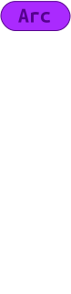

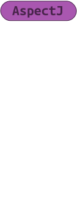

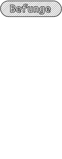

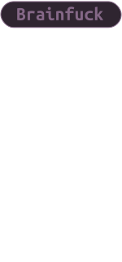

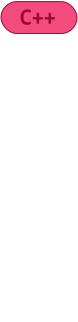

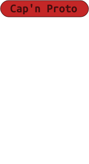

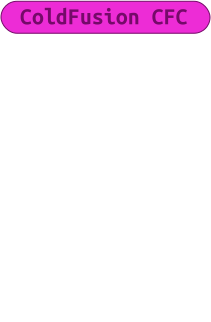

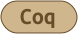

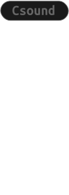

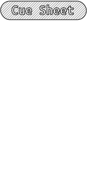

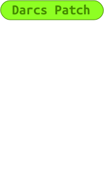

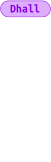

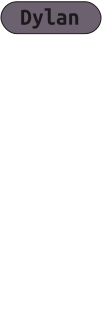

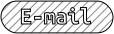

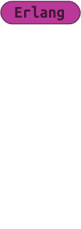

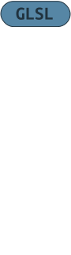

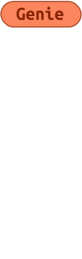

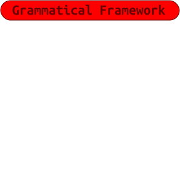

/rounded.svg)

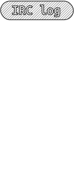

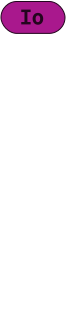

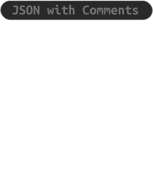

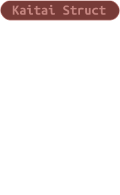

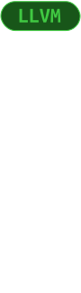
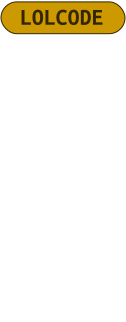

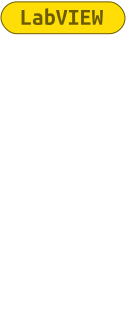

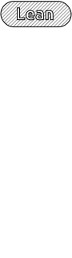

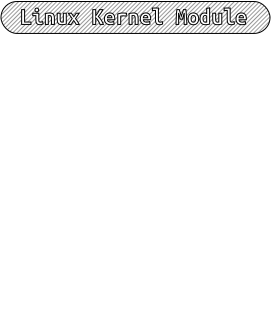

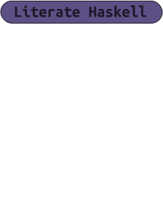

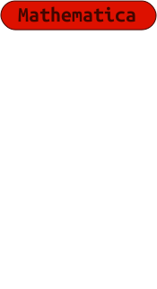

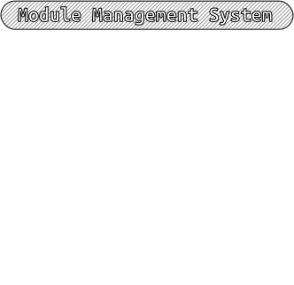
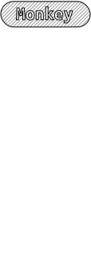

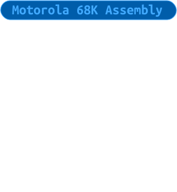
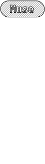

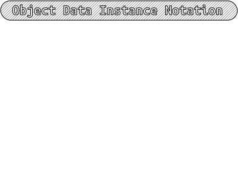

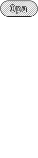
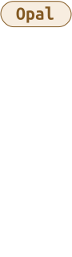

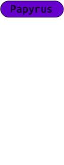

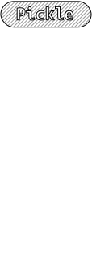

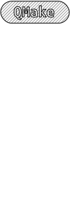
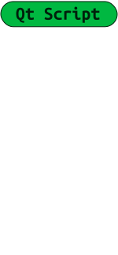

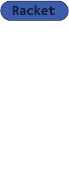

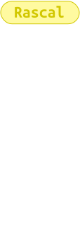

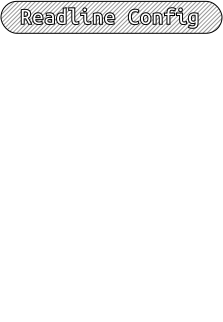

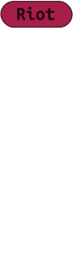

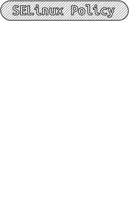
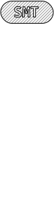

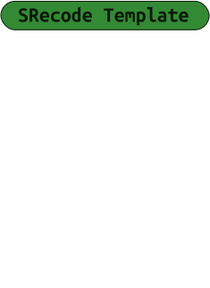

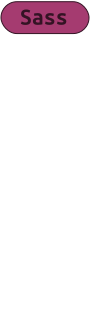

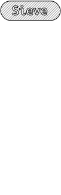

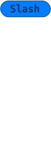

Made with ❤ by me.

Josélio Júnior - 2021

